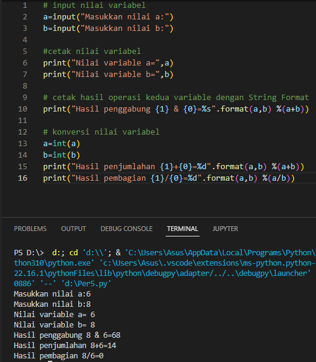

# Tugas Praktikum 3
## Berikut Dibawah Ini Adalah Program Menghitung Luas Dan Keliling Lingkaran Beserta Hasilnya

## Dan Berikut Flowchart Program Menghitung Luas dan Keliling Lingkaran 

## Latihan 1

## Latihan 2
